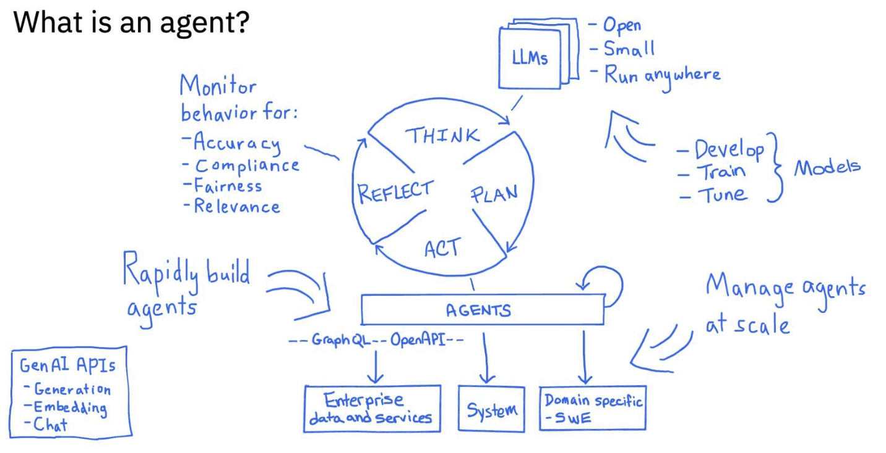

# Understanding Agents Within the DDO Framework

## Agent Definition

An **AI agent** is a software entity capable of reasoning, planning, and taking actions to fulfill a task — autonomously or semi-autonomously. Agents typically operate in a structured loop:

THINK → PLAN → ACT → REFLECT → (repeat)

This feedback loop allows them to:
- Reason through problems
- Generate strategies
- Execute those strategies via tools or APIs
- Assess outcomes and adapt

---

## Core Agent Behavior Cycle

**1. THINK**  
- Analyze prompt or environment state  
- Understand the current situation using LLM(s)  
- Ingest memory/context if available

**2. PLAN**  
- Determine which tools, APIs, or steps are needed  
- Sequence actions toward a goal  
- May include sub-agent creation or task decomposition

**3. ACT**  
- Call APIs, query knowledge sources, write data  
- Trigger workflows, integrate with enterprise systems  
- Respond to users, if appropriate

**4. REFLECT**  
- Evaluate success or failure of the action  
- Log outcomes and update state or memory  
- Rerun THINK with improved context

This loop can execute once or continuously until a goal is achieved.

---

## LLMs in Agent Design

LLMs provide the **reasoning engine** behind agents. They are:

- **Open** (e.g., LLaMA, Mistral), used for internal deployment or compliance needs  
- **Small** and efficient models that can run at the edge  
- **Tuned** for specific domains via few-shot, fine-tuning, or retrieval augmentation  
- **Interchangeable** in DDO via the ToolRouter (e.g., Bedrock, OpenAI, Claude)

---

## Agent Capabilities with DDO

| Function | Enabled by DDO |
|----------|----------------|
| Build and run agents | Agent Runtimes (e.g., LangGraph, CrewAI) |
| Route model/tool calls | ToolRouter |
| Provide contextual memory | MemoryManager |
| Govern actions and data | GovernanceEngine |
| Observe performance and behavior | TelemetryService |
| Scale securely across domains | Multi-tenant orchestration layer |
| Interface with systems | OpenAPI / GraphQL integration points |
| Maintain domain-awareness | DomainContextManager |

---

## Execution Flow (Inside DDO)

1. A user or system submits a request.
2. DDO’s DomainContextManager detects the domain and role (e.g., finance, HR, developer).
3. The agent is selected or created via the Agent Runtime.
4. ToolRouter injects available LLMs, APIs, or tools.
5. MemoryManager loads relevant past data or task history.
6. The agent runs its THINK → PLAN → ACT → REFLECT cycle.
7. GovernanceEngine enforces policies at each step.
8. TelemetryService logs every stage for future replay, tuning, and compliance.

---

## Monitoring Agent Behavior at Scale

DDO enables systematic monitoring across agents for:

- **Accuracy** (task completion, correctness)  
- **Compliance** (adherence to rules, regulatory constraints)  
- **Fairness** (bias detection, equitable decision logic)  
- **Relevance** (goal alignment, user intent matching)

These signals feed back into tuning loops, reporting dashboards, or automatic routing adjustments.

