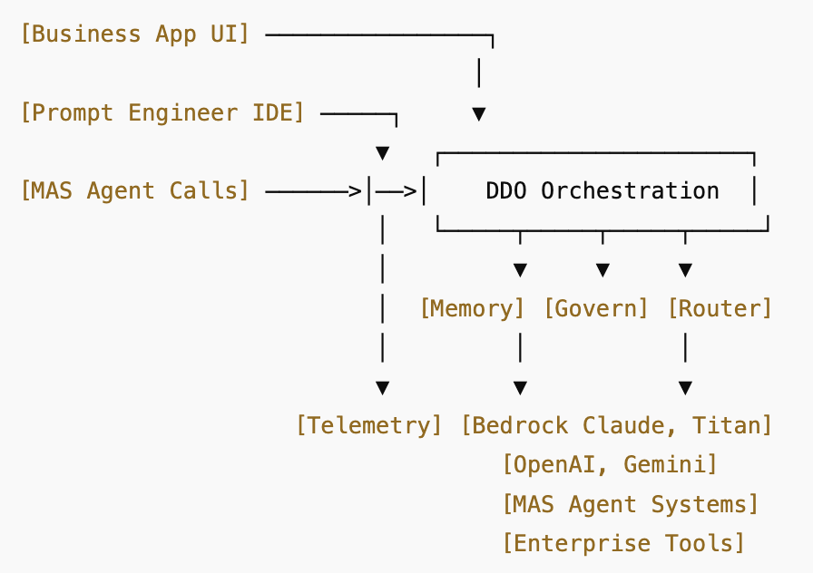

# DDO Framework – Domain-Driven Orchestration

## Overview

The DDO Framework provides a modular architecture to orchestrate GenAI tools, agents, and models across multi-cloud and hybrid environments — governed by domains, enriched by memory, and secured by policy.

---

## Core Loop (Request Flow)

---

## Core Components

### 🧠 OrchestrationEngine
The brain of DDO. Coordinates execution flow, tool calls, memory injection, and agent selection.

### 🧬 DomainContextManager
Parses persona, domain, and intent to route intelligently. Integrates with identity layer and user metadata.

### 🔌 ToolRouter
Routed decision layer for:
- OpenAI
- AWS Bedrock
- Claude / Gemini / watsonx
- Internal APIs / RAG toolkits / DBs

### 💾 MemoryManager
Unified memory layer:
- Short-term + long-term memory
- Redis / Weaviate / Chroma / DuckDB / Postgres
- Injects memory into prompt pipelines

### 🔐 GovernanceEngine
Applies rules and policies:
- GDPR / AI Act / Role-based constraints
- Content moderation / output filtering
- Tool access and LLM permissioning

### 📊 TelemetryService
- Tracing, audit logs, usage metrics
- OpenTelemetry-compatible
- Enables replay and observability

---

## Integrated Components

- Agent Runtimes: LangChain / LangGraph / CrewAI / MetaGPT
- LLMs: Bedrock / OpenAI / Claude / Gemini / Mistral / watsonx
- APIs & Tools: REST, GraphQL, internal data APIs, Vector search, RAG

---

## Deployment Modes

- 🧱 **Equinix Metal** with private cloud interconnects (Direct Connect, ExpressRoute, etc.)
- ☁️ **ROSA / OpenShift** with Istio Mesh
- 🌍 **Multi-tenant SaaS** with private agent pods per org/domain

---

## Status

Currently refactoring VM-based prototype into microservice architecture:
- `orchestrator-service`
- `context-service`
- `tool-router`
- `memory-service`
- `governance-engine`
- `telemetry-agent`
- `api-gateway`

All services mesh-enabled and ready for GitOps + observability stack.

---

## License

Apache 2.0
